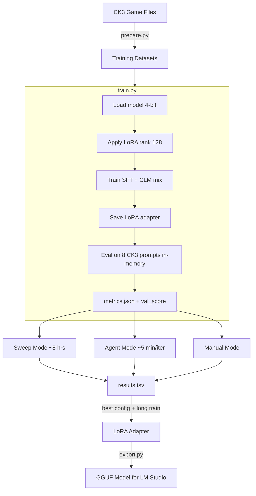
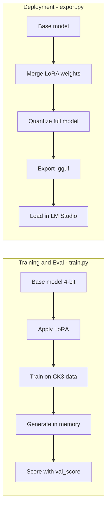
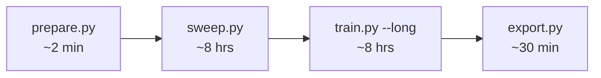
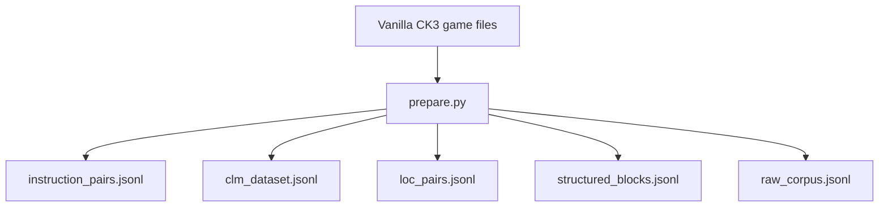

# CK3 Modding LLM AutoTune

Train a local LLM to natively understand CK3 modding — scope chains, trigger/effect logic, vanilla patterns — so it can write working mods without RAG or reference docs.

## Architecture



- **CK3 Game Files**: ~4,000 files, ~400K lines
- **Training Datasets**: instruction_pairs (32K SFT), clm_dataset (CLM), loc_pairs, structured_blocks, raw_corpus
- **Sweep Mode**: sweep.py runs train.py 96x with different configs
- **Agent Mode**: Claude edits train.py, calls sweep MCP tools
- **Manual Mode**: run train.py directly (5 min or `--long`)

## Key Concept: Eval uses the in-memory model, not GGUF



Training & eval is what matters for iteration. Deployment is just packaging — run once at the end.

## Execution Flow



1. **prepare.py** — Extract CK3 game data into 5 dataset files (run once)
2. **sweep.py** — Run train.py 96x with different configs (run overnight)
3. **train.py --long** — Deep train the best config
4. **export.py** — Merge LoRA into base, quantize to GGUF (run once)

## Quick start

**Requirements:** NVIDIA GPU (tested on RTX A4500 20GB), Python 3.10+, CK3 installed.

```bash
# 1. Install dependencies
pip install torch torchvision --index-url https://download.pytorch.org/whl/cu128
pip install unsloth transformers datasets peft trl bitsandbytes accelerate openai xformers fastmcp

# 2. Extract CK3 training data from vanilla game files (~2 min)
python prepare.py

# 3. Find the best config overnight
python sweep.py                         # full grid (~8 hours, 96 experiments)
python sweep.py --max-experiments 6     # quick test (~30 min)
python sweep.py --dry-run               # preview experiments

# 4. Deep train the winner
python train.py --long --resume

# 5. Export to GGUF for LM Studio (deployment only — not needed for training/eval)
python export.py                        # default q4_k_m
python export.py --quant q5_k_m         # higher quality
```

## Agent mode (Claude iterates)

Claude Code reads `agent.md` and runs experiments in a loop — making creative structural changes to train.py/prepare.py and calling sweep MCP tools for numerical optimization.

```bash
# Start the agent in Claude Code:
Read agent.md and let's kick off a new CK3 research experiment!
```

## CLI flags

### train.py

| Flag | Description |
|------|-------------|
| (none) | Train 5 min, eval in-process |
| `--long` | Train 8 hours |
| `--resume` | Continue from saved LoRA adapter |
| `--eval-only` | Only evaluate existing adapter (in-process, no GGUF) |

### sweep.py

| Flag | Description |
|------|-------------|
| `--dry-run` | Preview experiments without running |
| `--grid PATH` | Load grid from JSON file |
| `--max-experiments N` | Limit number of experiments |
| `--time-budget N` | Seconds per experiment (default 300) |

### export.py

| Flag | Description |
|------|-------------|
| `--quant METHOD` | Quantization: q4_k_m (default), q5_k_m, q8_0, f16 |
| `--adapter PATH` | Path to LoRA adapter directory |
| `--output PATH` | Output directory for GGUF files |

## Sweep MCP Tools

Register in Claude Code settings:
```json
{
  "mcpServers": {
    "ck3-sweep": {
      "command": "python",
      "args": ["sweep_mcp/server.py"]
    }
  }
}
```

| Tool | Description |
|------|-------------|
| `run_sweep(grid, time_budget)` | Run grid search, return results |
| `run_experiment(overrides)` | Single experiment with specific config |
| `get_results(sort_by)` | Read results.tsv sorted |
| `get_best_config()` | Highest val_score config |
| `get_status()` | Experiment count, best adapter path |
| `resume_best(time_budget)` | Long-train the winner |

## Default sweep grid

```python
DEFAULT_GRID = {
    "LEARNING_RATE": [1e-4, 2e-4, 5e-4],       #  3 values
    "CLM_MIX_RATIO": [0.0, 0.1, 0.2, 0.3],     #  4 values
    "GRADIENT_ACCUMULATION": [4, 8],             #  2 values
    "NUM_EPOCHS": [1, 3],                        #  2 values
    "LORA_DROPOUT": [0.0, 0.05],                 #  2 values
}                                                # ─────────
                                                 #  96 combos
```

Fixed parameters (not in grid): LoRA rank 128 (maxed for 20GB VRAM), base model darkc0de/Qwen3.5-9B-heretic.

## Current config

| Setting | Value |
|---------|-------|
| Base model | `darkc0de/Qwen3.5-9B-heretic` |
| LoRA rank | 128 |
| LoRA alpha | 256 |
| Context | 8192 |
| Batch | 1 x 4 = 4 effective |
| VRAM peak | ~18GB |

## The metric

**val_score** (0-1, higher is better) — composite of:
- **syntax_score** (40%): balanced braces, proper assignments, no Python contamination
- **keyword_score** (30%): expected CK3 keywords present (triggers, effects, scopes)
- **structure_score** (30%): proper block nesting, scope chain patterns

Evaluated on 8 fixed CK3 modding prompts directly on the in-memory model (no GGUF export needed).

## Project structure

```
ck3-modding-llm-autotune/
├── prepare.py            Data extraction + evaluation metric
├── train.py              Fine-tuning + in-process eval (agent modifies this)
├── sweep.py              Grid search (calls train.py as subprocess)
├── export.py             Merge LoRA into base + export GGUF (deployment only)
├── evaluate.py           Standalone LM Studio evaluation
├── agent.md            Agent instructions
├── README.md
├── SETUP.md
├── results.tsv           Experiment results (generated)
└── sweep_mcp/
    ├── __init__.py
    └── server.py          MCP server for sweep tools
```

## Data pipeline



| Dataset | Contents |
|---------|----------|
| instruction_pairs.jsonl | 32K instruction/completion pairs for SFT |
| clm_dataset.jsonl | Continued pretraining documents |
| loc_pairs.jsonl | Localization pattern examples |
| structured_blocks.jsonl | Individual parsed blocks |
| raw_corpus.jsonl | Every script file as raw text |

Cached at `~/.cache/ck3_modding_llm_autotune/data/` — not included in the repo.

## Output

```
~/.cache/ck3_modding_llm_autotune/output/
├── lora_adapter/     LoRA adapter from latest training run
├── best/             Best adapter from sweep (auto-saved)
├── gguf/             Full merged GGUF model (created by export.py)
├── samples/          Generated eval samples (timestamped)
├── checkpoints/      Training checkpoints
└── metrics.json      Latest experiment metrics
```

## Requirements

Requires a licensed copy of [Crusader Kings III](https://store.steampowered.com/app/1158310/Crusader_Kings_III/). Training data is extracted from vanilla game files at runtime — no game assets are included in this repository.

## License

AGPL-3.0
